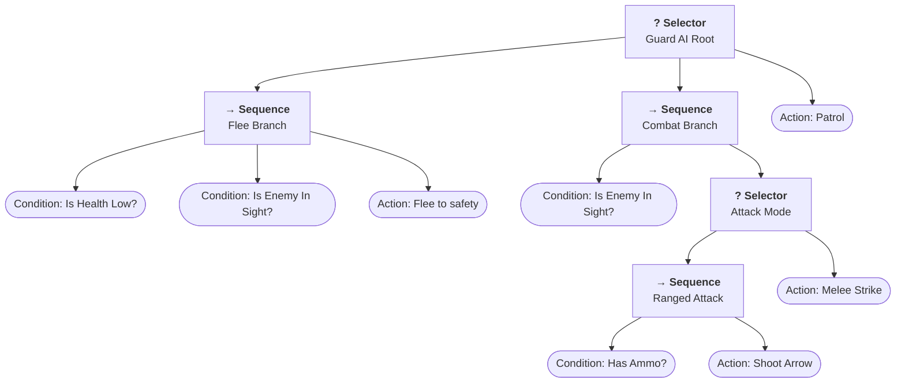

# Behavior Trees (Part 1: The Core Foundation)

Behavior Trees (BTs) are a modular, hierarchical model for AI decision-making. Widely used in video games (Halo, Unreal Engine), robotics (ROS), and agent workflows.

---

## 1. What is a Behavior Tree? (Top-Down View)

Think of a Behavior Tree as an organized checklist with priority rules that answers one question on every cycle (**Tick**):

> **"Given the current state of the world, what should I do right now?"**



---

## 2. The 3 Status Signals

Every node in the tree implements one method: `tick(): NodeStatus`. It must return one of three signals:

| Status | Meaning | Real-world Analogy |
|---|---|---|
| `SUCCESS` | The action completed or the condition is true | "I found food / Target hit" |
| `FAILURE` | The action cannot proceed or condition is false | "No enemy in sight / Out of ammo" |
| `RUNNING` | The action takes multiple ticks to finish | "Walking to coordinate (x, y)..." |

---

## 3. The Two Basic Building Blocks

### A. Leaf Nodes (Actions & Conditions)
- The "workers" at the bottom of the tree.
- They check the world state (e.g., `isHealthLow()`) or perform an action (e.g., `shootArrow()`).

### B. Composite Nodes (Control Flow)
Decide *which child node* to run next:

#### 1. `Sequence` (AND-Logic `->`)
- Runs children **left to right**.
- If a child returns `FAILURE` $\rightarrow$ **stops immediately** and returns `FAILURE`.
- If a child returns `RUNNING` $\rightarrow$ returns `RUNNING`.
- Only returns `SUCCESS` if **every single child** succeeds.
- *Use case*: Multi-step procedures. E.g., `[Find Enemy] -> [Aim] -> [Fire]`.

#### 2. `Selector` (OR-Logic / Fallback `?`)
- Runs children **left to right** by priority.
- If a child returns `SUCCESS` $\rightarrow$ **stops immediately** and returns `SUCCESS`.
- If a child returns `RUNNING` $\rightarrow$ returns `RUNNING`.
- Only returns `FAILURE` if **all children** fail.
- *Use case*: Prioritized fallback plans. E.g., `[Flee if Low HP] OR [Attack if Enemy Near] OR [Patrol]`.

---

## 4. Directory Structure

```text
behavior-trees/
├── src/
│   ├── index.ts          # Public library exports
│   ├── core.ts           # BT primitives (NodeStatus, Action, Sequence, Selector)
│   └── visualizer.ts     # Visualizers (toAscii, toMermaid, trace overlays)
├── examples/
│   ├── demo.ts           # Castle guard simulation
│   └── visualize.ts      # Visualizer script (ASCII & Mermaid outputs)
└── tests/
    ├── core.test.ts      # Unit tests for primitives
    └── visualizer.test.ts # Unit tests for visualizer
```

---

## 5. Running with Bun

```bash
cd behavior-trees

# Run the NPC simulation
bun run demo

# Run the visualizer
bun run visualize

# Run the test suite
bun test
```

---

## What We Will Disclose Next (Progressive Disclosure)
When you're ready, we will explore:
1. **Decorators / Modifiers**: Inverters (`NOT`), Repeaters, Cooldown timers.
2. **The Blackboard**: A shared memory store so nodes can pass data (e.g., target location) without tight coupling.
3. **Running States & Asynchronous Actions**: Multi-tick navigation and animation delays.
