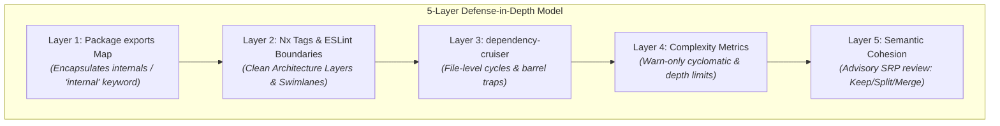
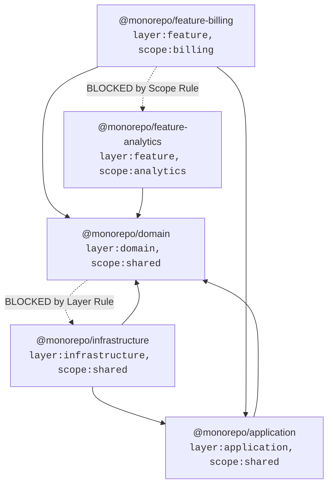

# TypeScript Monorepo Module Boundaries & Architecture Guide

A comprehensive, production-grade guide and reference implementation for enforcing strict architectural boundaries in TypeScript monorepos.

---

## 🎯 Why This Exists: The .NET vs TypeScript Gap

In **.NET / C#**, the compiler and project system give you strong encapsulation and boundary guarantees out of the box:

1. **Assembly Reference Gating (`<ProjectReference>`)**: You cannot import or use types from an assembly unless your `.csproj` explicitly references it.
2. **Encapsulation (`internal`)**: Classes and members marked `internal` are invisible to external assemblies, establishing a true public API surface.
3. **No Circular References**: MSBuild strictly forbids circular project references at build time.
4. **Architecture Analyzers**: Libraries like `NetArchTest` and `ArchUnitNET` enforce Clean Architecture rules (e.g. *Domain must never reference Infrastructure*).
5. **Maintainability Metrics**: Visual Studio and Roslyn analyzers track cyclomatic complexity and maintainability index.

In a **default TypeScript monorepo**, **none of this exists**:
- Any file can import any other file via relative paths (`../../packages/infrastructure/src/secret.ts`).
- Every exported symbol is globally reachable across the repository.
- Circular imports compile silently and corrupt runtime state (resulting in `undefined` values, uninitialized bindings, or TDZ errors).
- Architecture layering exists only as an unenforced convention in developers' heads.

This repository demonstrates how to assemble a **5-Layer Defense-in-Depth Architecture** that restores full .NET-grade boundary guarantees in TypeScript.

---

## 🏛️ The 5-Layer Defense-in-Depth Model

| Layer | Responsibility | .NET Analogue | Modern TypeScript Solution |
| :--- | :--- | :--- | :--- |
| **1. Package Exports Map** | Encapsulates package internals; defines public surface | `internal` access modifier | Node.js `package.json` `"exports"` + `.harness` check |
| **2. Project Tags & Boundaries** | Enforces layer and domain swimlane dependency rules | `<ProjectReference>` + ArchUnitNET | Nx Project Tags + ESLint `depConstraints` (Boundary-only) |
| **3. File Cycles & Graph** | Prevents circular dependencies at file & barrel level | MSBuild circular project build error | **Oxlint** `import/no-cycle` + `dependency-cruiser` |
| **4. Complexity Metrics** | Identifies logic hotspots and parameter bloat | Roslyn maintainability analyzers | **Oxlint** `complexity` (**Warn-Only**) |
| **5. Semantic Cohesion Review** | Evaluates single responsibility (Keep / Split / Merge) | Senior dev / NDepend architecture review | Automated Advisory Cohesion Analysis (LLM) |


---

## 📂 Repository Structure

```text
ts-module-boundaries/
├── package.json
├── tsconfig.json
├── .oxlintrc.json                      # Oxlint warn-only rules (complexity, max-depth, max-params)
├── .dependency-cruiser.cjs             # Depcruise cycle prevention & layer rules
├── src/
│   ├── demo.ts                         # Unified interactive CLI tour for all 5 concepts
│   │
│   ├── 01-package-exports/             # CONCEPT 1: Package exports map (internal keyword)
│   │   ├── surface-guard.ts            # Programmatic audit of package encapsulation
│   │   ├── lib-open/                   # Anti-pattern: No exports map (internals leaked)
│   │   └── lib-guarded/                # Clean pattern: Strict subpath exports map
│   │
│   ├── 02-project-tags-and-boundaries/ # CONCEPT 2: Nx project tags & ESLint depConstraints
│   │   ├── boundary-engine.ts          # Rule evaluator for layer & scope constraints
│   │   ├── eslint.config.sample.js     # Sample @nx/enforce-module-boundaries setup
│   │   └── packages/
│   │       ├── domain/                 # [layer:domain, scope:shared]
│   │       ├── application/            # [layer:application, scope:shared]
│   │       ├── infrastructure/         # [layer:infrastructure, scope:shared]
│   │       ├── feature-billing/        # [layer:feature, scope:billing]
│   │       └── feature-analytics/      # [layer:feature, scope:analytics]
│   │
│   ├── 03-dependency-cruiser-cycles/   # CONCEPT 3: Cycle detection & baselining legacy debt
│   │   ├── cycle-detector.ts           # Cycle DFS engine & baseline filter
│   │   ├── circular-basic/             # a.ts <-> b.ts direct cycle (runtime undefined trap)
│   │   ├── circular-barrel/            # feature -> barrel index.ts -> helper -> feature
│   │   ├── circular-legacy/            # Frozen tech debt baselined via pathNot exception
│   │   └── clean/                      # Clean acyclic architecture
│   │
│   ├── 04-complexity-metrics/          # CONCEPT 4: Complexity linting & warn-only policy
│   │   ├── metric-scanner.ts           # AST/lexical cyclomatic & nesting depth scanner
│   │   ├── complex-samples.ts          # Anti-patterns (branchy logic, deep nesting, param bloat)
│   │   └── clean-samples.ts            # Clean alternatives (lookup tables, guard clauses, DTOs)
│   │
│   └── 05-semantic-cohesion/           # CONCEPT 5: Semantic cohesion & advisory review
│       ├── cohesion-evaluator.ts       # Single responsibility & concern analyzer
│       ├── mixed-service.ts            # God Object mixing HTTP, SQL, Domain, and HTML
│       ├── domain/invoice.ts           # Pure business domain rules & calculations
│       ├── repository/                 # Clean persistence contract & in-memory storage
│       ├── formatter/                  # Presentation formatting
│       └── controller/                 # HTTP transport & status orchestration
│
└── tests/                              # Comprehensive Bun test suites for all 5 concepts
    ├── 01-package-exports.test.ts
    ├── 02-project-tags-and-boundaries.test.ts
    ├── 03-dependency-cruiser-cycles.test.ts
    ├── 04-complexity-metrics.test.ts
    └── 05-semantic-cohesion.test.ts
```

---

## 🔍 Deep-Dive: The 5 Concepts

### Concept 1: The Package `exports` Map & Barrel Hygiene (`internal`)
By defining an `"exports"` field in `package.json`, Node.js and TypeScript runtime loaders strictly block consumers from importing internal files:

```json
{
  "name": "@monorepo/guarded-lib",
  "type": "module",
  "exports": {
    // ✅ ATTENTION: "types" condition MUST be listed first for TypeScript resolution
    ".": {
      "types": "./src/index.ts",
      "import": "./src/index.ts"
    },
    // ✅ ATTENTION: Curated secondary subpath (deliberate public entry point)
    "./utilities": {
      "types": "./src/utilities.ts",
      "import": "./src/utilities.ts"
    }
    // ⚠️ CRITICAL: Never add wildcard catch-alls ("./*": "./src/*") — it disables encapsulation!
  }
}
```

> **.NET vs TypeScript Architectural Difference**:  
> In .NET, 1 `.csproj` = 1 `.dll` = 1 public entry point. Splitting testing, contracts, or adapters requires creating separate `.csproj` projects.  
> In TypeScript, a single package can expose multiple curated subpaths (`"."`, `"./engine"`, `"./contracts"`). However, to prevent monorepo anarchy, production repos enforce a **strict allowlist (`CURATED_SUBPATHS_ALLOWED`)** so developers cannot invent ad-hoc subpaths without architectural review.

#### 🔒 Dual Compile-Time & Runtime Gating:
```typescript
// ❌ FORBIDDEN: Deep internal import attempt
import { secret } from "@monorepo/guarded-lib/src/internal/secret.js";
// ↳ 1. COMPILE-TIME (tsc): error TS2307: Subpath is not defined by "exports"
// ↳ 2. RUNTIME (Node/Bun): Error [ERR_PACKAGE_PATH_NOT_EXPORTED]
```

#### ⚠️ Barrel Curation Rule (Symbol-Axis Hygiene):
```typescript
// ❌ FORBIDDEN: Wildcard re-export leaks internal helper functions into public surface
export * from "./user.service.js"; 

// ✅ REQUIRED: Explicitly curated named exports & type-only exports
export { UserService } from "./user.service.js";
export type { UserDTO } from "./user.types.js"; // Type erased at runtime (0 bytes)
```

#### ⚠️ The `tsconfig.json` `paths` Trap:
```jsonc
// ❌ ANTI-PATTERN in Monorepos: Adding 'paths' causes tsc to BYPASS package.json exports!
"paths": { "@monorepo/*": ["libs/*"] } // DO NOT USE

// ✅ BEST PRACTICE: Omit 'paths', use 'moduleResolution: "Node16"' + pnpm workspace symlinks.
"moduleResolution": "Node16" // tsc strictly enforces package.json "exports" at compile time!
```
### Concept 2: Project Tags & Module Boundaries (`@nx`)
Enforces directional architecture layering and domain swimlane isolation via ESLint `depConstraints`:



---

### Concept 3: Dependency Cruiser & Circular Imports
Circular imports in TypeScript create **Temporal Dead Zone (TDZ)** traps where bindings are accessed before initialization:

```typescript
// a.ts
import { b } from "./b.js";
export const a = "ModuleA";
console.log(b); // Can be undefined or throw ReferenceError!

// b.ts
import { a } from "./a.js";
export const b = "ModuleB";
console.log(a);
```

`.dependency-cruiser.cjs` blocks new cycles while allowing legacy baselining:
```javascript
module.exports = {
  forbidden: [
    {
      name: "no-circular",
      severity: "error",
      from: {},
      to: {
        circular: true,
        // Freeze legacy technical debt:
        pathNot: "^src/03-dependency-cruiser-cycles/circular-legacy"
      }
    }
  ]
};
```

---

### Concept 4: Complexity Metrics & Warn-Only Philosophy
- **Rule**: `complexity` (max: 5), `max-depth` (max: 3), `max-params` (max: 3).
- **Philosophy**: Warn-only! Setting complexity limits to `error` induces **"code shredding"**—developers unnaturally chop coherent functions into trivial 1-line private wrappers just to bypass a linter error. Warn-only illuminates hotspots for human code review while keeping the CI pipeline green.

---

### Concept 5: Semantic Cohesion & Advisory Review
Mechanical tools (AST, linters, dependency graphs) are blind to business semantics. A function can have complexity 3 and still mix HTTP handling, database queries, and tax calculations.

Our advisory cohesion analyzer inspects architectural dimensions:
- **`HTTP_TRANSPORT`**: Status codes, headers, body parsing
- **`PERSISTENCE_DB`**: SQL statements, table structures, database adapters
- **`BUSINESS_DOMAIN`**: Invariants, tax calculations, state transitions
- **`PRESENTATION_FORMAT`**: HTML rendering, template formatting

Emits clear advisory verdicts: **`KEEP`**, **`SPLIT`**, **`MERGE`**, or **`PROMOTE_TO_PACKAGE`**.

---

## 🚀 Running the Tour, Tests, & Linters

### Run the Interactive CLI Tour
```bash
# Run all 5 concepts in sequence
bun run demo

# Or run individual concept tours
bun run src/demo.ts 1  # Package Exports
bun run src/demo.ts 2  # Project Tags & Boundaries
bun run src/demo.ts 3  # Dependency Cruiser & Cycles
bun run src/demo.ts 4  # Complexity Metrics
bun run src/demo.ts 5  # Semantic Cohesion Review
```

### Run the Test Suite
```bash
bun test
```

### Run Linters
```bash
# Check complexity metrics (Oxlint)
bun run lint:oxlint

# Check file-level dependency cycles (dependency-cruiser)
bun run lint:depgraph
```
