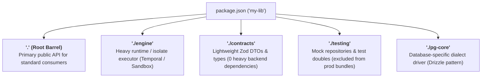

# Concept 1: The Package `exports` Map — Your `internal` Keyword

> **Layer 1 of the 5-Layer Defense-in-Depth Model**  
> **Core Guarantee**: Encapsulate private package implementation details, curate explicit public API barrel files, and enforce deterministic conditional module resolution at runtime and compile time.

---

## 1. The Fundamental Problem: TypeScript Has No `internal` Keyword

In default JavaScript and TypeScript package management, **every exported symbol across every file in your repository is reachable by any consumer** if they specify the relative file path:

```typescript
// 🚨 Deep path breach!
import { internalDbCredentials } from "example-open-lib/src/internal/secret.js";
```

### Why this is dangerous:
1. **Accidental Public Contract**: The moment an external service or library imports an internal file, that internal file becomes an accidental part of your public API contract.
2. **Blocked Refactoring**: You can no longer rename, relocate, or refactor private helper functions or credentials without breaking downstream callers.
3. **Leaked Encapsulation**: Internal caches, mutable state, or raw SQL queries bypass domain abstractions.

---

## 2. The .NET / C# Analogue

| Dimension | .NET / C# | Modern TypeScript (`NodeNext` / `Bundler`) |
| :--- | :--- | :--- |
| **Encapsulation Concept** | `internal` access modifier | `package.json` `"exports"` field |
| **Compile-Time Gate (`tsc`)** | `CS0122: 'X' is inaccessible due to its protection level` | `error TS2307: Subpath './internal/secret' is not defined by "exports"` |
| **Runtime Gate (Node/Bun)** | CLR Assembly Boundary Access Violation | `Error [ERR_PACKAGE_PATH_NOT_EXPORTED]` |
| **Unit Test Access** | `[InternalsVisibleTo("TestAssembly")]` | Private test runner harness targeting package-internal paths |

In modern TypeScript (`moduleResolution: "NodeNext"` or `"Bundler"`), the `"exports"` map is **BOTH a compile-time and a runtime boundary**:
1. **Compile-Time (`tsc` / VS Code)**: TypeScript reads `"exports"` directly. Attempting to import an unmapped path causes `tsc` to fail with error `TS2307` and shows a red squiggly in the editor.
2. **Runtime (Node.js / Bun)**: The native ECMAScript module loader checks `"exports"` upon module evaluation and throws `ERR_PACKAGE_PATH_NOT_EXPORTED`.

---

## 3. How the `exports` Map Works

The `"exports"` field in `package.json` replaces the legacy `"main"` field with explicit entry point mappings:

```json
{
  "name": "example-guarded-lib",
  "version": "1.0.0",
  "type": "module",
  "exports": {
    ".": "./src/index.ts",
    "./utilities": "./src/utilities.ts"
  }
}
```

### Resolution Rules:
- **`import "example-guarded-lib"`**: Maps to `./src/index.ts` (✅ Allowed).
- **`import "example-guarded-lib/utilities"`**: Maps to `./src/utilities.ts` (✅ Allowed).
- **`import "example-guarded-lib/src/internal/secret.js"`**: **NOT** in the map. The module loader halts with:
  ```text
  Error [ERR_PACKAGE_PATH_NOT_EXPORTED]: Package subpath './src/internal/secret.js' is not defined by "exports" in .../package.json
  ```

---

## 4. Barrel Hygiene: Wildcard Leaks vs Curated Public Surfaces

Even when a package defines an `"exports"` map, how your public entrypoint (`index.ts`) re-exports symbols determines whether private utilities stay hidden.

### 4.1 The Leaky Barrel Anti-Pattern (`export *`)
Using wildcard re-exports dumps all internal helpers, private hashing functions, and internal credentials directly into the public surface:

```typescript
// ❌ leaky-barrel/index.ts
export * from "./internal-details.js";
```

```typescript
// 🚨 Consumer imports the barrel and gets internal secrets by accident!
import { PublicService, _secretHasher, INTERNAL_SECRET_KEY } from "leaky-barrel";
```

**Why Wildcard Re-Exports Fail in Production:**
1. **Accidental Exposure**: Any helper exported for unit tests in `internal-details.ts` is now exposed to consumers.
2. **Broken Tree-Shaking**: Bundlers (Rollup, Webpack, esbuild) often struggle to eliminate unused code across wildcard re-exports.
3. **Symbol Collisions**: Adding an export in any referenced file risks breaking consumers due to namespace collisions.

### 4.2 The Curated Barrel Best Practice
A compliant barrel file uses explicit named exports and type-only exports:

```typescript
// ✅ curated-barrel/index.ts
export { PublicService } from "./internal-details.js";
export type { UserDTO } from "./internal-details.js";
```

- **Explicit Value Exports**: Only `PublicService` is part of the JavaScript bundle.
- **Type-Only Exports (`export type`)**: `UserDTO` is erased during compilation (`undefined` at JS runtime), guaranteeing zero runtime overhead.
- **Encapsulated Secrets**: `_secretHasher` and `INTERNAL_SECRET_KEY` remain completely invisible outside the module.

---

## 5. Conditional Exports: ESM, CommonJS, and the "Types-First" Rule

Packages supporting multiple runtime formats or consuming environments use **conditional exports**:

```json
{
  "name": "example-dual-package",
  "version": "1.0.0",
  "type": "module",
  "exports": {
    ".": {
      "types": "./src/index.d.ts",
      "import": "./src/index.ts",
      "require": "./dist/index.cjs"
    }
  }
}
```

### ⚠️ The Condition Ordering Rule: `"types"` MUST Be First!

In Node.js and TypeScript, condition keys in the `"exports"` object are matched in **object definition order**:
1. When resolving types, TypeScript inspects the condition map from top to bottom.
2. If `"import"` or `"require"` appears **before** `"types"`, TypeScript's resolver may match the runtime JavaScript file first and fail to locate declaration files (`.d.ts`).

```json
// ❌ Anti-pattern: TypeScript may resolve ./src/index.ts before reading type definitions
"exports": {
  ".": {
    "import": "./src/index.ts",
    "types": "./src/index.d.ts"
  }
}

// ✅ Correct: "types" always appears first
"exports": {
  ".": {
    "types": "./src/index.d.ts",
    "import": "./src/index.ts",
    "require": "./dist/index.cjs"
  }
}
```

---

## 6. Subpath Exports Beyond `.` — When to Use Them vs .NET Assemblies

In **.NET**, one `.csproj` project strictly compiles to one `.dll` with a single root namespace entry point. If you want to split a library into contracts, testing fixtures, or database adapters, .NET forces you to create **multiple separate `.csproj` projects** (`MyLib.csproj`, `MyLib.Contracts.csproj`, `MyLib.Testing.csproj`).

In **TypeScript / Node.js**, a single package can publish multiple curated subpaths (`"."`, `"./contracts"`, `"./engine"`, `"./testing"`) without creating dozens of separate `package.json` packages.

### 🎯 The 5 Legitimate Architectural Use Cases for Subpaths



1. **Heavy Engine / SDK Isolation (The Temporal Sandbox Pattern)**:
   - **Problem**: Temporal workflow code runs in a deterministic V8 isolate that crashes if it imports `@nestjs/common`, `pg`, or `drizzle-orm`.
   - **Solution**: The root barrel `.` exports standard NestJS services; `./engine` exports the isolated workflow executor.
   - **Consumer**: Web API imports `@my-lib`; Background Worker imports `@my-lib/engine`.

2. **Lightweight Contracts & Schemas vs Heavy Backend Services**:
   - **Problem**: A React frontend or Lambda edge function needs Zod validation schemas from a backend package, but the package root barrel connects to Stripe, Postgres, and AWS SDK.
   - **Solution**: Publish `./contracts` exposing pure Zod schemas with zero backend runtime dependencies.
   - **Consumer**: `import { InvoiceSchema } from "@my-lib/contracts"`.

3. **Database Dialect / Driver Splits (e.g. `drizzle-orm`)**:
   - **Problem**: Supporting Postgres, MySQL, and SQLite in one package shouldn't force consumers to install all 3 native drivers (`pg`, `mysql2`, `better-sqlite3`).
   - **Solution**: Publish `./pg-core`, `./mysql-core`, `./sqlite-core`.

4. **Production Code vs Test Doubles & Mock Fixtures**:
   - **Problem**: Downstream test suites need `MockUserRepository` and fake token generators, but mock code must never leak into production client bundles.
   - **Solution**: Publish `./testing` (`import { MockUserRepository } from "@my-lib/testing"`).

5. **Optional DevTools & UI Panels (e.g. `@tanstack/react-query`)**:
   - **Problem**: DevTools components should only be bundled when explicitly imported in debug mode.
   - **Solution**: Publish `./devtools` (`import { ReactQueryDevtools } from "@tanstack/react-query/devtools"`).

---

### ⚖️ The Architectural Tradeoff: Flexibility vs Monorepo Anarchy

| Dimension | .NET / C# Approach | TypeScript / Node.js Approach |
| :--- | :--- | :--- |
| **Granularity Unit** | 1 Assembly (`.csproj`) = 1 Entry Point | 1 Package (`package.json`) = N Subpaths |
| **Package Count** | High (50+ tiny `.csproj` files across a solution) | Low (Consolidated feature packages) |
| **Risk of Inconsistency** | Low (Compiler strictly enforces 1 `.dll`) | **High (Developers invent ad-hoc subpaths everywhere)** |
| **Production Rule** | Architecture analyzers enforce project references | **CI Harness strictly gates subpaths via allowlist** |

> **The Golden Rule in Production (The Draiver Stance)**:  
> Every library **MUST** publish a single `.` barrel by default. Additional subpaths (`./engine`, `./contracts`) are **strictly prohibited unless explicitly whitelisted in a CI harness allowlist (`CURATED_SUBPATHS_ALLOWED`)**. This gives you the dependency isolation of subpaths without allowing package organization to degrade into an unmaintainable free-for-all.

---

## 7. Code Walkthrough in this Folder

```text
01-package-exports/
├── lib-open/                       # ❌ Anti-pattern: No exports map (unprotected internals)
│   ├── package.json
│   └── src/
│       ├── index.ts
│       ├── public.ts
│       └── internal/secret.ts
│
├── lib-guarded/                    # ✅ Best Practice: Strict exports map
│   ├── package.json                # Defines "." and "./utilities"
│   └── src/
│       ├── index.ts
│       ├── public.ts
│       ├── utilities.ts
│       └── internal/secret.ts      # BLOCKED from external deep import
│
├── barrel-hygiene/
│   ├── leaky-barrel/               # ❌ Anti-pattern: export * dumps _secretHasher & keys
│   │   ├── internal-details.ts
│   │   └── index.ts
│   └── curated-barrel/             # ✅ Best Practice: Curated named & type-only exports
│       ├── internal-details.ts
│       └── index.ts
│
├── conditional-exports/
│   ├── dual-package/               # ✅ Dual ESM/CJS with "types" first
│   │   ├── package.json
│   │   ├── src/ (index.ts, index.d.ts)
│   │   └── dist/ (index.cjs)
│   └── misordered-package/         # ❌ Anti-pattern: "import" precedes "types"
│       └── package.json
│
├── surface-guard.ts                # Contract test auditor (exports map, barrel hygiene, condition order)
└── demo.ts                         # Interactive multi-part terminal demonstration
```

---

## 7. Automated Contract Audits with `surface-guard.ts`

In production monorepos, use `surface-guard.ts` in CI contract tests to assert:
1. **Exports Map Presence**: Every published workspace package defines `"exports"`.
2. **No Wildcard Catch-Alls**: No `"./*": "./*"` bypasses exist in `package.json`.
3. **Barrel Hygiene**: Barrels do not contain `export * from` wildcard re-exports (matching Draiver-style module surface rules).
4. **Conditional Order**: Any conditional mapping places `"types"` first.
5. **Target Existence**: All mapped paths and type files resolve to valid files on disk.

---

## 8. How to Run & Verify

```bash
# Run the interactive concept demo
bun run src/demo.ts 1

# Run the full test suite
bun test tests/01-package-exports.test.ts
```
