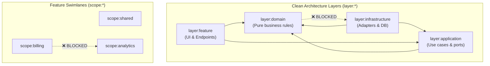

# Concept 2: Project Tags & Module Boundaries (`@nx`)

> **Layer 2 of the 5-Layer Defense-in-Depth Model**  
> **Core Guarantee**: Enforce directional Clean Architecture layering and feature swimlane isolation across monorepo projects.

---

## 1. The Fundamental Problem: Monorepo Architecture Decay

In a TypeScript monorepo with multiple packages or apps, the TypeScript compiler allows any package to import any other package:

```typescript
// Inside packages/domain/src/user.ts
// 🚨 Architectural Inversion: Domain importing Infrastructure!
import { PostgresConnection } from "@monorepo/infrastructure";

// Inside packages/feature-billing/src/checkout.ts
// 🚨 Cross-Feature Coupling: Billing importing Analytics directly!
import { trackFunnelEvent } from "@monorepo/feature-analytics";
```

### Why this happens:
- In a team's codebase, architectural rules like *"Domain must never import Infrastructure"* or *"Features must communicate via events, not direct imports"* are often just verbal agreements or wiki documents.
- Under deadline pressure, developers make direct cross-package imports, turning a clean modular architecture into an entangled **"distributed monolith"**.

---

## 2. The .NET / C# Analogue

| .NET / C# | TypeScript Monorepo Parity |
| :--- | :--- |
| `<ProjectReference Include="..\Domain\Domain.csproj" />` | `package.json` dependencies + Project Graph |
| ArchUnitNET / NetArchTest rule:<br/>`Types().That().ResideInNamespace("Domain").ShouldNot().HaveDependencyOn("Infrastructure")` | ESLint `@nx/enforce-module-boundaries`<br/>with `depConstraints` |
| Assembly separation per feature / bounded context | Project Tags (`scope:billing`, `scope:analytics`) |

In .NET, if project A doesn't reference project B in its `.csproj`, compilation fails immediately. Architecture test frameworks (ArchUnitNET) add semantic assertions.  
In TypeScript monorepos, **Nx project tags + ESLint `depConstraints`** provide compile/lint-time gating for both mechanical references and architectural layers.

---

## 3. The Two-Axis Tagging Matrix

Every project in the monorepo is tagged along two orthogonal axes:



### 1. The Layer Axis (`layer:*`)
- `layer:domain` $\rightarrow$ May only depend on `layer:domain`.
- `layer:application` $\rightarrow$ May depend on `layer:domain`, `layer:application`.
- `layer:infrastructure` $\rightarrow$ May depend on `layer:application`, `layer:domain`, `layer:infrastructure`.
- `layer:feature` $\rightarrow$ May depend on `layer:application`, `layer:domain`, `layer:feature`.

### 2. The Scope Axis (`scope:*`)
- `scope:shared` $\rightarrow$ Utility/core libraries usable by all scopes.
- `scope:billing` $\rightarrow$ May only depend on `scope:billing` or `scope:shared`.
- `scope:analytics` $\rightarrow$ May only depend on `scope:analytics` or `scope:shared`.
- **Rule**: Sibling feature scopes may **never** import each other directly.

---

## 4. Configuration: ESLint Flat Config (`depConstraints`)

In `eslint.config.mjs`:

```javascript
import nxPlugin from "@nx/eslint-plugin";

export default [
  {
    plugins: { "@nx": nxPlugin },
    rules: {
      "@nx/enforce-module-boundaries": [
        "error",
        {
          enforceBuildableLibDependency: true,
          allow: [],
          depConstraints: [
            // Layer Rules
            {
              sourceTag: "layer:domain",
              onlyDependOnLibsWithTags: ["layer:domain"]
            },
            {
              sourceTag: "layer:application",
              onlyDependOnLibsWithTags: ["layer:domain", "layer:application"]
            },
            {
              sourceTag: "layer:infrastructure",
              onlyDependOnLibsWithTags: ["layer:infrastructure", "layer:application", "layer:domain"]
            },
            // Scope / Swimlane Rules
            {
              sourceTag: "scope:billing",
              onlyDependOnLibsWithTags: ["scope:billing", "scope:shared"]
            },
            {
              sourceTag: "scope:analytics",
              onlyDependOnLibsWithTags: ["scope:analytics", "scope:shared"]
            }
          ]
        }
      ]
    }
  }
];
```

---

## 5. Code Walkthrough in this Folder

```text
02-project-tags-and-boundaries/
├── boundary-engine.ts          # Core rule validation engine implementing depConstraints algorithm
├── eslint.config.sample.js     # Production-ready ESLint flat configuration sample
├── demo.ts                     # Runnable demo showing legal edges and blocked violations
└── packages/
    ├── domain/                 # Tags: ["layer:domain", "scope:shared"]
    ├── application/            # Tags: ["layer:application", "scope:shared"]
    ├── infrastructure/         # Tags: ["layer:infrastructure", "scope:shared"]
    ├── feature-billing/        # Tags: ["layer:feature", "scope:billing"]
    └── feature-analytics/      # Tags: ["layer:feature", "scope:analytics"]
```

---

## 6. How to Run & Verify

```bash
# Run the concept demo (validates allowed flows & demonstrates blocked violations)
bun run src/demo.ts 2

# Run the test suite
bun test tests/02-project-tags-and-boundaries.test.ts
```
