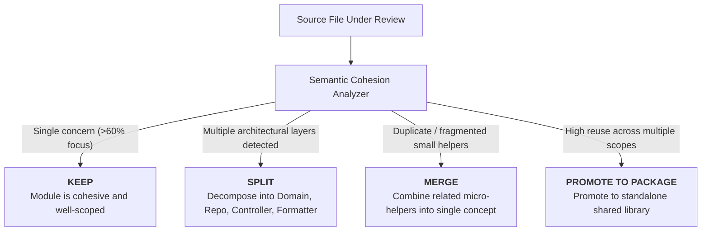

# Concept 5: Semantic Cohesion & Advisory Review

> **Layer 5 of the 5-Layer Defense-in-Depth Model**  
> **Core Guarantee**: Identify mixed responsibilities and God objects through semantic cohesion analysis, providing actionable architectural verdicts (`Keep`, `Split`, `Merge`, `Promote`).

---

## 1. The Fundamental Problem: Mechanical Tools Are Blind to Meaning

Layers 1–4 are all **mechanical** and syntax-driven:
- The `exports` map checks string paths in `package.json`.
- Nx boundary rules check tag strings.
- `dependency-cruiser` checks file import edges.
- Oxlint counts branch keywords (`if`, `switch`).

**None of them understand what code actually *does*.**

A 40-line class can have:
- An `exports` map (Layer 1: ✅)
- Valid monorepo tags (Layer 2: ✅)
- Zero circular imports (Layer 3: ✅)
- Low cyclomatic complexity of 3 (Layer 4: ✅)

...yet simultaneously contain:
1. HTTP request/response handling (`status 201`, `application/json` headers)
2. Raw SQL queries (`INSERT INTO invoices...`)
3. Domain tax and subtotal calculations
4. HTML template generation (`<div class="invoice">...</div>`)

This is a **God Object**. It couples 4 different reasons to change into a single fragile module.

---

## 2. The .NET / C# Analogue

| .NET / C# | TypeScript Parity |
| :--- | :--- |
| Senior Software Architect / Staff Engineer Code Review | Automated Advisory LLM / Cohesion Analysis |
| NDepend Semantic Coupling & Single Responsibility Analysis | Semantic concern extraction & scoring |
| Advisory architecture review comment on Pull Requests | PR bot / CLI advisory suggestion (**Non-blocking**) |

---

## 3. The 4 Actionable Verdicts

Our semantic cohesion analyzer evaluates changed modules across architectural dimensions:



1. **`KEEP`**: The module focuses on a single responsibility (e.g. Pure Domain Entity, pure Repository, or pure HTTP Controller).
2. **`SPLIT`**: The module mixes concerns across transport, storage, domain logic, or presentation. Recommend specific target modules.
3. **`MERGE`**: Two or more fragmented helper files represent the same core concept and should be unified.
4. **`PROMOTE_TO_PACKAGE`**: An internal utility has become a mature capability that should be extracted into its own `@monorepo/*` package with an `exports` map and project tags.

---

## 4. Why Advisory (Never a Hard Gate)?

### The Risk of Hard Gating Semantic Analysis:
- Semantic reasoning (e.g., via LLMs or heuristic analyzers) is probabilistic, not deterministic.
- If a semantic check is configured as a blocking CI gate (`exit code != 0`), non-deterministic failures frustrate engineers and train teams to ignore or disable boundary tools.

### The Two-Step Architectural Lifecycle:
1. **Advisory Phase (Soft Judgment)**: Semantic analyzers / senior engineers review code changes and suggest architectural boundaries (e.g., *"This helper deserves its own package"* or *"Split this God class into domain + repository"*).
2. **Enforcement Phase (Mechanical Lock)**: Once the team agrees on the split, **Layers 1, 2, and 3 lock the boundary**:
   - The new package gets an `exports` map (Layer 1).
   - The project gets tags and `depConstraints` (Layer 2).
   - Dependency graphs prevent back-channel cycles (Layer 3).

> **Principle**: *Soft judgment discovers boundaries; hard mechanical tools enforce and preserve them.*

---

## 5. Code Walkthrough in this Folder

```text
05-semantic-cohesion/
├── cohesion-evaluator.ts       # Evaluator detecting concerns (HTTP, DB, Domain, Presentation)
├── mixed-service.ts            # ❌ God Object anti-pattern (Cohesion: 25%, Verdict: SPLIT)
│
└── decomposed-cohesive/        # ✅ Clean Decomposed Architecture (Cohesion: 100%, Verdict: KEEP)
    ├── domain/invoice.ts       # Pure Business Domain Entity & Invariant Rules
    ├── repository/             # Pure Persistence Contract & Storage Implementation
    │   ├── invoice-repository.interface.ts
    │   └── memory-invoice-repository.ts
    ├── formatter/              # Pure Presentation & Invoice Rendering
    │   └── invoice-formatter.ts
    └── controller/             # Pure HTTP Transport & Status Orchestration
        └── invoice-controller.ts
```

---

## 6. How to Run & Verify

```bash
# Run the concept demo (analyzes the God Object vs Decomposed Architecture)
bun run src/demo.ts 5

# Run the test suite
bun test tests/05-semantic-cohesion.test.ts
```
