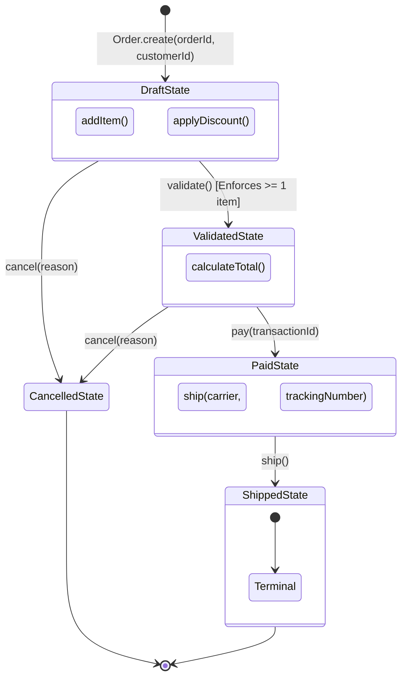

# TypeScript Type-Level Architecture: Newtype & Typestate Patterns

> **Turn runtime bugs into compile-time build errors with zero runtime memory allocation and zero performance overhead.**

---

## 1. Why Do These Patterns Exist?

In standard TypeScript applications, two major classes of bugs plague production systems:

1. **Primitive Obsession & Accidental Parameter Swapping**:  
   Because TypeScript uses **structural (duck) typing**, `type UserId = string` and `type OrderId = string` are completely interchangeable to the compiler. Swapping arguments `charge(orderId, userId)` compiles cleanly and silently charges the wrong account.
2. **Temporal & Lifecycle Ordering Bugs**:  
   Entities track their state via runtime properties (`status: "draft" | "paid" | "shipped"`). Calling methods out of order (such as dispatching an unpaid order or editing a shipped order) requires defensive runtime `if` checks and causes unhandled runtime exceptions when missed.

The **Newtype** and **Typestate** patterns use TypeScript's advanced type system (phantom symbols and generic polymorphic `this` types) to make these bugs **impossible to compile**.

---

## 2. Conceptual Parity Matrix (.NET / Rust / TypeScript)

| Concept | .NET Equivalent | Rust Equivalent | TypeScript Type-Level Solution |
| :--- | :--- | :--- | :--- |
| **Newtype (Nominal Types)** | `readonly record struct UserId(string Value)` / Strongly Typed IDs | `struct UserId(String);` tuple struct | `Brand<string, "UserId">` with phantom unique symbol |
| **Smart Constructors** | Value Object factory with invariant checks (`UserId.Create(...)`) | `impl UserId { pub fn new(...) -> Result<Self, Error> }` | Validating factory function returning branded type |
| **Typestate Machine** | Generic state classes `Order<DraftState>` with builder transitions | `struct Order<State> { state: State }` with trait bounds | `Order<State extends OrderStateToken>` with `this` narrowing |
| **Runtime Overhead** | Struct allocation / wrapping overhead | **Zero** (Rust newtypes are zero-cost abstractions) | **Zero** (Brand tags and phantom states erased at compile time) |

---

## 3. Typestate Lifecycle State Machine



---

## 4. Deep Dive: Concept 1 — The Newtype Pattern (Branded Types)

### The Problem:
```typescript
// ❌ SILENT BUG: Both are aliases for string!
type UserId = string;
type OrderId = string;

function cancelOrder(userId: UserId, orderId: OrderId) { ... }

// Compiler sees string, string -> compiles without errors!
cancelOrder(orderId, userId); 
```

### The Solution (`src/newtype.ts`):
```typescript
// 🔒 COMPILE-TIME: Unique phantom symbol that only exists in the type checker
declare const __brand: unique symbol;

export type Brand<T, BrandTag extends string> = T & {
  readonly [__brand]: BrandTag;
};

export type UserId = Brand<string, "UserId">;
export type OrderId = Brand<string, "OrderId">;
export type PositiveCents = Brand<number, "PositiveCents">;

// ✅ ATTENTION: Smart constructors gate creation and enforce invariants
export function makeUserId(raw: string): UserId {
  // ⚠️ CRITICAL: Enforce domain invariants before branding
  if (!raw.startsWith("usr_") || raw.length < 8) {
    throw new Error(`Invalid UserId: ${raw}`);
  }
  return raw as UserId;
}

export function makePositiveCents(amount: number): PositiveCents {
  if (!Number.isSafeInteger(amount) || amount <= 0) {
    throw new Error(`PositiveCents must be an integer > 0. Received: ${amount}`);
  }
  return amount as PositiveCents;
}
```

### Compile-Time Enforcement:
```typescript
const user = makeUserId("usr_alice99");
const order = makeOrderId("ord_2026_01");
const amount = makePositiveCents(4500);

// ✅ Valid execution
processCharge(user, order, amount);

// ❌ FORBIDDEN: Swapping user and order
// 🔒 COMPILE-TIME: TS2345: Type '"OrderId"' is not assignable to type '"UserId"'.
processCharge(order, user, amount);

// ❌ FORBIDDEN: Passing unvalidated raw strings
// 🔒 COMPILE-TIME: TS2345: Argument of type 'string' is not assignable to 'UserId'.
processCharge("usr_alice99", order, amount);
```

---

## 5. Deep Dive: Concept 2 — The Typestate Pattern

### The Problem:
```typescript
class Order {
  status: "draft" | "validated" | "paid" | "shipped" = "draft";
  
  ship(trackingNumber: string) {
    // ⚠️ Requires defensive runtime check on every invocation!
    if (this.status !== "paid") {
      throw new Error("Cannot ship unpaid order!");
    }
    // ...
  }
}

// ❌ Crash occurs at runtime in production when called out of sequence:
const order = new Order();
order.ship("TRACK_123"); // Uncaught Error: Cannot ship unpaid order!
```

### The Solution (`src/typestate.ts`):
```typescript
// 1. Phantom State Markers (Zero runtime memory)
export interface DraftState { readonly __lifecycleState: "Draft"; }
export interface ValidatedState { readonly __lifecycleState: "Validated"; }
export interface PaidState { readonly __lifecycleState: "Paid"; }
export interface ShippedState { readonly __lifecycleState: "Shipped"; }

// 2. State-Parameterized Entity
export class Order<State> {
  declare private readonly _state: State;

  static create(id: OrderId, customerId: UserId): Order<DraftState> {
    return new Order<DraftState>(id, customerId, []);
  }

  // 🔒 COMPILE-TIME: Only available when 'this' is Order<DraftState>
  addItem(this: Order<DraftState>, sku: Sku, price: PositiveCents, qty: number): Order<DraftState> {
    return new Order<DraftState>(this.id, this.customerId, [...this.items, { sku, price, qty }]);
  }

  // ⚠️ CRITICAL: State Transition: Draft -> Validated
  validate(this: Order<DraftState>): Order<ValidatedState> {
    if (this.items.length === 0) throw new Error("Cannot validate empty cart");
    return new Order<ValidatedState>(this.id, this.customerId, this.items);
  }

  // ⚠️ CRITICAL: State Transition: Validated -> Paid
  pay(this: Order<ValidatedState>, transactionId: string): Order<PaidState> {
    return new Order<PaidState>(this.id, this.customerId, this.items, ...);
  }

  // ⚠️ CRITICAL: State Transition: Paid -> Shipped
  ship(this: Order<PaidState>, carrier: "DHL" | "FedEx", trackingNumber: string): Order<ShippedState> {
    return new Order<ShippedState>(this.id, this.customerId, this.items, ...);
  }
}
```

---

## 6. The Compile-Time Impossibility Matrix

| Illegal Attempt | Traditional OOP | Typestate Pattern |
| :--- | :--- | :--- |
| `draftOrder.ship("DHL", "123")` | Runtime crash / Silent bug | 🔒 **TS2345**: `this` context `Order<DraftState>` cannot call `ship()` |
| `paidOrder.addItem(sku, price, 1)` | Data corruption after billing | 🔒 **TS2345**: `this` context `Order<PaidState>` cannot call `addItem()` |
| `shippedOrder.pay("receipt")` | Double payment bug | 🔒 **TS2345**: `this` context `Order<ShippedState>` cannot call `pay()` |
| `processCharge(orderId, userId, price)` | Charges wrong account | 🔒 **TS2345**: `OrderId` is not assignable to `UserId` |

---

## 7. Running the Code & Verification

```bash
# Navigate to the experiment directory
cd ts-type-level-safety

# Run the interactive CLI simulation
bun run demo

# Run the full unit and compile-time test suite (12 tests)
bun test

# Run strict TypeScript compiler checks
bun run typecheck
```
