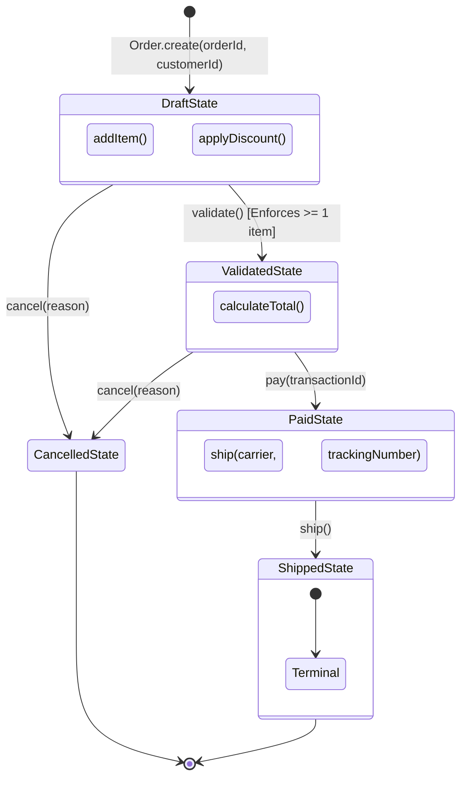

# TypeScript Type-Level Architecture: Newtype & Typestate Patterns

> **Turn runtime bugs into compile-time build errors with zero runtime memory allocation and zero performance overhead.**

---

## 1. Why Do These Patterns Exist?

In standard TypeScript applications, two major classes of bugs plague production systems:

1. **Primitive Obsession & Accidental Parameter Swapping**:  
   Because TypeScript uses **structural (duck) typing**, `type UserId = string` and `type OrderId = string` are completely interchangeable to the compiler. Swapping arguments `charge(orderId, userId)` compiles cleanly and silently charges the wrong account.
2. **Temporal & Lifecycle Ordering Bugs**:  
   Entities track their state via runtime properties (`status: "draft" | "paid" | "shipped"`). Calling methods out of order (such as dispatching an unpaid order or editing a shipped order) requires defensive runtime `if` checks and causes unhandled runtime exceptions when missed.

The **Newtype** and **Typestate** patterns use TypeScript's advanced type system (phantom symbols, template literals, and generic polymorphic `this` types) to make these bugs **impossible to compile**.

---

## 2. Conceptual Parity Matrix (.NET / Rust / TypeScript)

| Concept | .NET Equivalent | Rust Equivalent | TypeScript Type-Level Solution |
| :--- | :--- | :--- | :--- |
| **Newtype (Nominal Types)** | `readonly record struct UserId(string Value)` | `struct UserId(String);` tuple struct | `Brand<string, "UserId">` with phantom unique symbol |
| **Template Literal Gating** | Custom Roslyn Analyzers / Source Generators | Compile-time proc macros | `Brand<`usr_${string}`, "UserId">` (Evaluated by compiler) |
| **Number Range Constraints** | Value Object with exception in constructor | `NonZeroU32` / Custom bounded wrappers | `PositiveInt<T>` (Compile-time) + Smart Constructors |
| **Smart Constructors** | Factory methods (`UserId.Create(...)`) | `UserId::new(...) -> Result<Self, Error>` | Validating & sanitizing factory function (`makeUserId`) |
| **Assertion Functions** | `Debug.Assert(...)` / `ArgumentNullException.ThrowIfNull` | `panic!` / invariant assertions | `assertUserId(val): asserts val is UserId` (Narrows in-place) |
| **Typestate Machine** | Generic state classes with fluent builder transitions | `struct Order<State> { state: State }` with trait bounds | `Order<State extends OrderStateToken>` with `this` narrowing |
| **Runtime Overhead** | Struct allocation / wrapping overhead | **Zero** (Zero-cost abstraction) | **Zero** (Brand tags and phantom states erased at compile time) |

---

## 3. Typestate Lifecycle State Machine



---

## 4. Deep Dive: Concept 1 — Advanced Newtype & The "Triple Gate"

### 4.1 Combining Template Literal Types with Nominal Branding

In TypeScript, you can combine **Template Literal Types** (which validate string patterns for literal values at compile time) with **Phantom Branding** (which isolates dynamic values):

```typescript
// 🔒 COMPILE-TIME: Shape pattern + Nominal Brand
export type UserIdPattern = `usr_${string}`;
export type UserId = Brand<UserIdPattern, "UserId">;

// ✅ Literal strings matching the pattern pass type checking:
const staticAdmin = "usr_admin01" as UserId;

// ❌ Literal strings with wrong prefixes fail at compile time:
// TS2322: Type '"admin_bob"' is not assignable to type 'UserId'.
```

### 4.2 The "Triple Gate" Validation Architecture

When handling runtime inputs (from HTTP APIs, JSON bodies, or databases), you need three distinct validation strategies depending on the use case:

| Gate | Signature | When to Use | Trade-offs |
| :--- | :--- | :--- | :--- |
| **1. Predicate** | `isX(val): val is X` | Array filtering (`users.filter(isUserId)`), boolean branching (`if (isUserId(x))`) | Non-throwing; does not sanitize data. |
| **2. Assertion** | `assertX(val): asserts val is X` | Controller entry points, route handlers, unit tests, fast-fail pipelines | Narrows the variable in-place without reassignment; cannot sanitize data. |
| **3. Smart Constructor** | `makeX(val): X` | External ingestion (Forms, CLI inputs, JSON requests) | Trims, normalizes, sanitizes, and returns a new branded value. |

#### Code Example (`src/newtype.ts`):

```typescript
// Gate 1: Predicate (Boolean Guard)
export function isUserId(val: unknown): val is UserId {
  return typeof val === "string" && val.startsWith("usr_") && val.length >= 8;
}

// Gate 2: Assertion Function (In-Place Flow Narrowing)
export function assertUserId(val: unknown): asserts val is UserId {
  if (!isUserId(val)) {
    throw new Error(`[Invariant Violation] Expected UserId ('usr_*', >=8 chars), got: ${String(val)}`);
  }
}

// Gate 3: Smart Constructor (Sanitization + Validation)
export function makeUserId(raw: string): UserId {
  const trimmed = raw.trim();
  assertUserId(trimmed);
  return trimmed;
}
```

### 4.3 When Should You Use `asserts` vs `makeX`?

- **Use `asserts val is X` when:**
  - You are at the top of a controller / route handler and want to validate incoming function parameters in-place without declaring new `const validatedId = ...` variables.
  - You want early-return / fail-fast assertions in unit tests.
- **Use `makeX(raw)` when:**
  - The input needs **sanitization** (e.g. `raw.trim()`, `raw.toLowerCase()`). An assertion function **cannot** modify the value of the variable it narrows!
  - You are building pure functional pipelines where transformations produce new immutable values.

---

## 5. Type-Level Number Filters (`PositiveInt<T>`)

TypeScript template literal types can inspect number literals to reject negative numbers, zero, and decimals at compile time:

```typescript
// 🔒 COMPILE-TIME: Rejects negative, zero, and decimal number literals
export type PositiveInt<T extends number> =
  `${T}` extends `-${string}` | "0" | `${string}.${string}`
    ? never
    : T;

export function createVerifiedPrice<T extends number>(cents: PositiveInt<T>): PositiveCents {
  return cents as unknown as PositiveCents;
}

// ✅ Compiles!
createVerifiedPrice(2500); 

// ❌ COMPILE-TIME ERROR: TS2345: Argument of type 'number' is not assignable to parameter of type 'never'.
createVerifiedPrice(-50);  // Negative rejected!
createVerifiedPrice(0);    // Zero rejected!
createVerifiedPrice(12.5); // Float rejected!
```

---

## 6. Deep Dive: Concept 2 — The Typestate Pattern

### The Problem:
```typescript
class Order {
  status: "draft" | "validated" | "paid" | "shipped" = "draft";
  
  ship(trackingNumber: string) {
    if (this.status !== "paid") {
      throw new Error("Cannot ship unpaid order!");
    }
  }
}

// ❌ Crash occurs at runtime in production when called out of sequence:
const order = new Order();
order.ship("TRACK_123"); // Uncaught Error: Cannot ship unpaid order!
```

### The Solution (`src/typestate.ts`):
```typescript
// 1. Phantom State Markers (Zero runtime memory)
export interface DraftState { readonly __lifecycleState: "Draft"; }
export interface ValidatedState { readonly __lifecycleState: "Validated"; }
export interface PaidState { readonly __lifecycleState: "Paid"; }
export interface ShippedState { readonly __lifecycleState: "Shipped"; }

// 2. State-Parameterized Entity
export class Order<State extends OrderStateToken> {
  declare private readonly _state: State;

  static create(id: OrderId, customerId: UserId): Order<DraftState> {
    return new Order<DraftState>(id, customerId, []);
  }

  // 🔒 COMPILE-TIME: Only available when 'this' is Order<DraftState>
  addItem(this: Order<DraftState>, sku: Sku, price: PositiveCents, qty: number): Order<DraftState> {
    return new Order<DraftState>(this.id, this.customerId, [...this.items, { sku, price, qty }]);
  }

  // ⚠️ CRITICAL: State Transition: Draft -> Validated
  validate(this: Order<DraftState>): Order<ValidatedState> {
    if (this.items.length === 0) throw new Error("Cannot validate empty cart");
    return new Order<ValidatedState>(this.id, this.customerId, this.items);
  }

  // ⚠️ CRITICAL: State Transition: Validated -> Paid
  pay(this: Order<ValidatedState>, transactionId: string): Order<PaidState> {
    return new Order<PaidState>(this.id, this.customerId, this.items, ...);
  }

  // ⚠️ CRITICAL: State Transition: Paid -> Shipped
  ship(this: Order<PaidState>, carrier: "DHL" | "FedEx", trackingNumber: string): Order<ShippedState> {
    return new Order<ShippedState>(this.id, this.customerId, this.items, ...);
  }
}
```

---

## 7. The Compile-Time Impossibility Matrix

| Illegal Attempt | Traditional OOP | Typestate Pattern |
| :--- | :--- | :--- |
| `draftOrder.ship("DHL", "123")` | Runtime crash / Silent bug | 🔒 **TS2345**: `this` context `Order<DraftState>` cannot call `ship()` |
| `paidOrder.addItem(sku, price, 1)` | Data corruption after billing | 🔒 **TS2345**: `this` context `Order<PaidState>` cannot call `addItem()` |
| `shippedOrder.pay("receipt")` | Double payment bug | 🔒 **TS2345**: `this` context `Order<ShippedState>` cannot call `pay()` |
| `processCharge(orderId, userId, price)` | Charges wrong account | 🔒 **TS2345**: `OrderId` is not assignable to `UserId` |
| `createVerifiedPrice(-50)` | Negative monetary values | 🔒 **TS2345**: Argument of type 'number' is not assignable to 'never' |

---

## 8. Running the Code & Verification

```bash
# Navigate to the experiment directory
cd ts-type-level-safety

# Run the interactive CLI simulation
bun run demo

# Run the full unit and compile-time test suite (15 tests)
bun test

# Run strict TypeScript compiler checks
bun run typecheck
```
